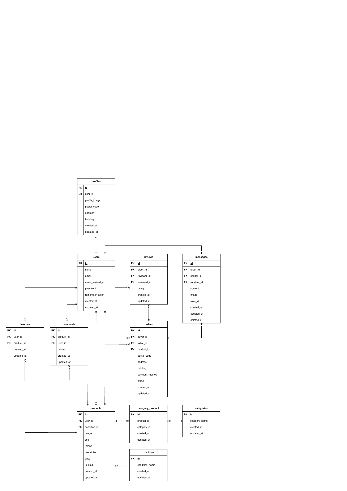

# フリーマーケットアプリ

Laravel を用いて開発したフリーマーケットアプリケーションです。
Docker による環境構築、Stripe を用いた決済、MailHog を利用したメール送信機能を実装しています。

## 環境構築

**Docker ビルド**

1. リポジトリをクローン

```bash
git clone git@github.com:n-saori-code/free-market-app-pro.git
```

2. DockerDesktop アプリを立ち上げる

3. クローンしたディレクトリ(free-market-app-pro)内に移動し、以下のコマンドで Docker コンテナをビルドして起動

```bash
docker-compose up -d --build
```

> _本プロジェクトでは、**M1/M2 Mac でもビルド可能** になるように `platform: linux/amd64` を指定済みです。_

```bash
# docker-compose.yml
nginx:
    platform: linux/amd64

php:
    platform: linux/amd64

mysql:
    platform: linux/amd64

phpmyadmin:
    platform: linux/amd64

# Dockerfile
FROM --platform=linux/amd64 php:8.1-fpm
```

> \_docker mysql コンテナの起動に失敗する場合は、以下を実行して mysql のデータをクリアにしてください。

```bash
# 1. Docker Compose を停止
docker-compose down

# 2. MySQL のデータを削除
rm -rf ./docker/mysql/data

# 3. MySQL コンテナを再起動
docker-compose up -d
```

**Laravel 環境構築**

1. コンテナに入る

```bash
docker-compose exec php bash
```

2. 依存パッケージをインストール

```bash
composer install
```

3. 「.env.example」ファイルを「.env」ファイルにコピーまたはリネーム

```bash
cp .env.example .env
```

4. .env に以下の環境変数を追加

```text
DB_CONNECTION=mysql
DB_HOST=mysql
DB_PORT=3306
DB_DATABASE=laravel_db
DB_USERNAME=laravel_user
DB_PASSWORD=laravel_pass
```

```text
MAIL_MAILER=smtp
MAIL_HOST=mailhog
MAIL_PORT=1025
MAIL_USERNAME=null
MAIL_PASSWORD=null
MAIL_ENCRYPTION=null
MAIL_FROM_ADDRESS=no-reply@example.com
MAIL_FROM_NAME="${APP_NAME}"
```

5. アプリケーションキーの作成

```bash
php artisan key:generate
```

6. マイグレーションの実行

```bash
php artisan migrate
```

7. シーディングの実行

```bash
php artisan db:seed
```

8. ストレージリンクの作成（画像表示のため）

```bash
php artisan storage:link
```

9. http://localhost/ にアクセスし、アプリの表示を確認してください。

## Stripe テスト決済の設定

1. [Stripe 公式サイト](https://stripe.com/jp) にアクセスし、テストモードでアカウントを登録します。
   管理画面の「開発者」→「API キー」から以下のキーを取得します。

2. `.env` に取得した Stripe の API キーを設定します。

```bash
STRIPE_KEY=pk_test_***************
STRIPE_SECRET=sk_test_***************
```

3. 支払い方法

「カード払い」の場合のテストカード情報：

```bash
カード番号: 4242 4242 4242 4242
有効期限: 任意 (例: 12/34)
CVC: 任意 (例: 123)
ZIP: 任意 (例: 123-4567)
```

「コンビニ払い」の場合は、必要事項を入力し支払い先を選択できます。<br>
※テストモードのため、実際の支払い処理までは進みません。
※取引画面まで進む場合は「カード払い」を選択してください。

4. 商品購入が成功
   ・決済後、商品一覧ページに遷移し、商品に「sold」表示がつきます。

**※出品した商品・購入済み商品ページの挙動は要件に明記がなかったため、コーチと相談の上、以下のように実装しています。**

- 詳細画面の「購入手続きへ」ボタンが「SOLD」となり、クリックできなくなります。
- コメント送信ボタンも無効化され、「売り切れの為、コメントできません。」と表示されます。
- 出品した商品の詳細画面では、ボタンが「出品者のため購入できません」となり、クリックできません。
- 出品商品の価格の上限は 4,294,967,295 円以下にしています。

## メール認証機能(使用技術：Mailhog)

### 会員登録

1. 会員登録後、メール認証画面に遷移
2. 「認証はこちらから」のボタンを押し、http://localhost:8025 にアクセスし、届いたメールを確認
3. メール内の「Verify Email Address」ボタンをクリック
4. 認証完了後、プロフィール設定画面に遷移

###　商品の取引完了時

1. 購入者が「取引を完了する」ボタンを押し、取引評価を送信
2. http://localhost:8025 にアクセスすると、出品者宛に取引完了通知メールを確認可能

## 初期ログインアカウント（シーディングで自動作成）

php artisan db:seed 実行後、以下のアカウントが自動的に登録されます。
※要件に記載がなかったので、管理者ユーザーには特に管理者の権限は与えておりません。

### 管理者アカウント

| ユーザー名     | メールアドレス    | パスワード    |
| -------------- | ----------------- | ------------- |
| 管理者ユーザー | admin@example.com | adminpassword |

### 一般ユーザーアカウント

| ユーザー名       | メールアドレス      | パスワード  | 出品した商品                                                     |
| ---------------- | ------------------- | ----------- | ---------------------------------------------------------------- |
| 一般ユーザー 001 | user001@example.com | password001 | 時計・HDD・玉ねぎ 3 束・革靴・ノート PC                          |
| 一般ユーザー 002 | user002@example.com | password002 | マイク・ショルダーバック・タンブラー・コーヒーミル・メイクセット |
| 一般ユーザー 003 | user003@example.com | password003 |                                                                  |

## テーブル仕様

### users テーブル

| カラム名          | 型              | primary key | unique key | not null | foreign key |
| ----------------- | --------------- | ----------- | ---------- | -------- | ----------- |
| id                | unsigned bigint | ◯           |            | ◯        |             |
| name              | varchar(255)    |             |            | ◯        |             |
| email             | varchar(255)    |             | ◯          | ◯        |             |
| email_verified_at | timestamp       |             |            |          |             |
| password          | varchar(255)    |             |            | ◯        |             |
| remember_token    | varchar(100)    |             |            |          |             |
| created_at        | timestamp       |             |            |          |             |
| updated_at        | timestamp       |             |            |          |             |

### profiles テーブル

| カラム名      | 型              | primary key | unique key | not null | foreign key |
| ------------- | --------------- | ----------- | ---------- | -------- | ----------- |
| id            | unsigned bigint | ◯           |            | ◯        |             |
| user_id       | unsigned bigint |             |            | ◯        | users(id)   |
| profile_image | varchar(255)    |             |            |          |             |
| postal_code   | varchar(255)    |             |            |          |             |
| address       | varchar(255)    |             |            |          |             |
| building      | varchar(255)    |             |            |          |             |
| created_at    | timestamp       |             |            |          |             |
| updated_at    | timestamp       |             |            |          |             |

### products テーブル

| カラム名     | 型              | primary key | unique key | not null | foreign key    |
| ------------ | --------------- | ----------- | ---------- | -------- | -------------- |
| id           | unsigned bigint | ◯           |            | ◯        |                |
| user_id      | unsigned bigint |             |            | ◯        | users(id)      |
| condition_id | unsigned bigint |             |            | ◯        | conditions(id) |
| image        | varchar(255)    |             |            | ◯        |                |
| title        | varchar(255)    |             |            | ◯        |                |
| brand        | varchar(255)    |             |            |          |                |
| description  | text            |             |            | ◯        |                |
| price        | int unsigned    |             |            | ◯        |                |
| is_sold      | boolean         |             |            | ◯        |                |
| created_at   | timestamp       |             |            |          |                |
| updated_at   | timestamp       |             |            |          |                |

### categories テーブル

| カラム名      | 型              | primary key | unique key | not null | foreign key |
| ------------- | --------------- | ----------- | ---------- | -------- | ----------- |
| id            | unsigned bigint | ◯           |            | ◯        |             |
| category_name | varchar(255)    |             | ◯          | ◯        |             |
| created_at    | timestamp       |             |            |          |             |
| updated_at    | timestamp       |             |            |          |             |

### conditions テーブル

| カラム名       | 型              | primary key | unique key | not null | foreign key |
| -------------- | --------------- | ----------- | ---------- | -------- | ----------- |
| id             | unsigned bigint | ◯           |            | ◯        |             |
| condition_name | varchar(255)    |             | ◯          | ◯        |             |
| created_at     | timestamp       |             |            |          |             |
| updated_at     | timestamp       |             |            |          |             |

### orders テーブル

| カラム名       | 型              | primary key | unique key | not null | foreign key  |
| -------------- | --------------- | ----------- | ---------- | -------- | ------------ |
| id             | unsigned bigint | ◯           |            | ◯        |              |
| buyer_id       | unsigned bigint |             |            | ◯        | users(id)    |
| seller_id      | unsigned bigint |             |            | ◯        | users(id)    |
| product_id     | unsigned bigint |             |            | ◯        | products(id) |
| postal_code    | varchar(255)    |             |            | ◯        |              |
| address        | varchar(255)    |             |            | ◯        |              |
| building       | varchar(255)    |             |            |          |              |
| payment_method | varchar(255)    |             |            |          |              |
| status         | varchar(255)    |             |            | ◯        |              |
| created_at     | timestamp       |             |            |          |              |
| updated_at     | timestamp       |             |            |          |              |

### comments テーブル

| カラム名   | 型              | primary key | unique key | not null | foreign key  |
| ---------- | --------------- | ----------- | ---------- | -------- | ------------ |
| id         | unsigned bigint | ◯           |            | ◯        |              |
| product_id | unsigned bigint |             |            | ◯        | products(id) |
| users_id   | unsigned bigint |             |            | ◯        | users(id)    |
| content    | text            |             |            | ◯        |              |
| created_at | timestamp       |             |            |          |              |
| updated_at | timestamp       |             |            |          |              |

### favorites テーブル

| カラム名   | 型              | primary key | unique key | not null | foreign key  |
| ---------- | --------------- | ----------- | ---------- | -------- | ------------ |
| id         | unsigned bigint | ◯           |            | ◯        |              |
| user_id    | unsigned bigint |             |            | ◯        | users(id)    |
| product_id | unsigned bigint |             |            | ◯        | products(id) |
| created_at | timestamp       |             |            |          |              |
| updated_at | timestamp       |             |            |          |              |

### category_product テーブル

| カラム名    | 型              | primary key | unique key | not null | foreign key    |
| ----------- | --------------- | ----------- | ---------- | -------- | -------------- |
| id          | unsigned bigint | ◯           |            | ◯        |                |
| product_id  | unsigned bigint |             |            | ◯        | products(id)   |
| category_id | unsigned bigint |             |            | ◯        | categories(id) |
| created_at  | timestamp       |             |            |          |                |
| updated_at  | timestamp       |             |            |          |                |

### reviews テーブル

| カラム名    | 型              | primary key | unique key | not null | foreign key |
| ----------- | --------------- | ----------- | ---------- | -------- | ----------- |
| id          | unsigned bigint | ◯           |            | ◯        |             |
| order_id    | unsigned bigint |             |            | ◯        | orders(id)  |
| reviewer_id | unsigned bigint |             |            | ◯        | users(id)   |
| reviewed_id | unsigned bigint |             |            | ◯        | users(id)   |
| rating      | int unsigned    |             |            | ◯        |             |
| created_at  | timestamp       |             |            |          |             |
| updated_at  | timestamp       |             |            |          |             |

### messages テーブル

| カラム名    | 型              | primary key | unique key | not null | foreign key |
| ----------- | --------------- | ----------- | ---------- | -------- | ----------- |
| id          | unsigned bigint | ◯           |            | ◯        |             |
| order_id    | unsigned bigint |             |            | ◯        | orders(id)  |
| sender_id   | unsigned bigint |             |            | ◯        | users(id)   |
| receiver_id | unsigned bigint |             |            | ◯        | users(id)   |
| content     | text            |             |            |          |             |
| image       | varchar(255)    |             |            |          |             |
| read_at     | timestamp       |             |            |          |             |
| created_at  | timestamp       |             |            |          |             |
| updated_at  | timestamp       |             |            |          |             |
| deleted_at  | timestamp       |             |            |          |             |

## ER 図



## テスト環境（PHPUnit）

テストは 開発用 DB に影響を与えない専用データベース demo_test を使用します。

1. テスト用データベースの作成<br>
   Docker 起動直後でまだ demo_test が存在しない場合は、以下の手順で作成してください：<br>
   パスワードは、docker-compose.yml ファイルの MYSQL_ROOT_PASSWORD:を参照。

### データベースの確認

```bash
docker exec -it free-market-app-pro-mysql-1 mysql -u root -p
SHOW DATABASES;
```

### データベースの作成

```bash
docker exec -it free-market-app-pro-mysql-1 bash
mysql -u root -p
CREATE DATABASE demo_test;
exit
```

> \_すでに存在する場合は、この手順は不要です。

2. config ファイルの変更<br>
   database.php を開き、以下の設定になっていることを確認してください。

```bash
'mysql_test' => [
'driver' => 'mysql',
'url' => env('DATABASE_URL'),
'host' => env('DB_HOST', '127.0.0.1'),
'port' => env('DB_PORT', '3306'),
'database' => 'demo_test',
'username' => 'root',
'password' => 'root',
'unix_socket' => env('DB_SOCKET', ''),
'charset' => 'utf8mb4',
'collation' => 'utf8mb4_unicode_ci',
'prefix' => '',
'prefix_indexes' => true,
'strict' => true,
'engine' => null,
'options' => extension_loaded('pdo_mysql') ? array_filter([
   PDO::MYSQL_ATTR_SSL_CA => env('MYSQL_ATTR_SSL_CA'),
]) : [],
],
```

3. .env.testing ファイルの文頭部分にある APP_ENV と APP_KEY を編集します。<br>
   またデータベースの接続情報を加えてください。

```bash
APP_ENV=test
APP_KEY=
```

```bash
DB_DATABASE=demo_test
DB_USERNAME=root
DB_PASSWORD=root
```

4. テスト用アプリケーションキーの生成<br>
   テスト実行時に必要なアプリケーションキーを生成します。

```bash
docker-compose exec php bash
php artisan key:generate --env=testing
```

以下でキャッシュをクリアにしてください。

```bash
php artisan config:clear
```

5. マイグレーションコマンドを実行して、テスト用のテーブルを作成します。

```bash
php artisan migrate --env=testing
```

6. phpunit.xml を開き、DB_CONNECTION と DB_DATABASE が以下になっているか確認してください。

```bash
<server name="DB_CONNECTION" value="mysql_test"/>
<server name="DB_DATABASE" value="demo_test"/>
```

7.  PHPUnit テストの実行<br>
    本番・開発用データベースには影響しません。<br>
    以下のコマンドを入力してください。<br>

```bash
# キャッシュをクリアにする
php artisan config:clear
```

```bash
# 個別テストファイルの実行
vendor/bin/phpunit tests/Feature/AuthTest.php
vendor/bin/phpunit tests/Feature/OrderTest.php
vendor/bin/phpunit tests/Feature/ProductTest.php
vendor/bin/phpunit tests/Feature/ProfileTest.php

# ディレクトリ単位でまとめて実行
vendor/bin/phpunit tests/Feature
```

## 使用技術(実行環境)

- PHP8.1.33
- Laravel8.83.8
- MySQL8.0.26
- nginx1.21.1
- Docker / Docker Compose
- Stripe（テストモード）
- MailHog

## URL

- 開発環境：http://localhost/
- ユーザー登録：http://localhost/register
- phpMyAdmin：http://localhost:8080/
- Mailhog：http://localhost:8025
